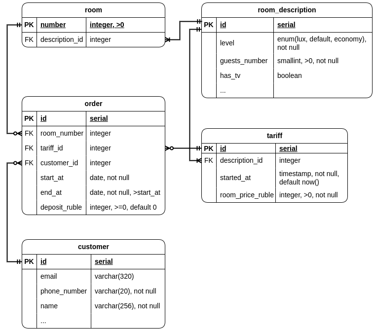

# mipt-db project

# База данных отеля

Управляем отелем, к которого есть свой сайт/API. Назначаем цены для разных номеров.  
Предославляем информацию о свободных номерах, их стоимости. Даем возможность забронировать номер.  
Храним некоторую информацию о пользователях, чтобы уточнить актуальность заказа.

## ДЗ 1-2

### Схема, ограничения
  
\* все PK - unique not null, все FK - not null

### Сценарии использования

1. Отобразить список комнат (цена, кол-во мест), отсортированный по цене.
   * м.б. отфильтрованный по параметрам описания (кол-во мест / люкс-не-люкс / ...)
1. Отобразить список комнат, свободных в заданный временной интервал.
1. Отобразить информацию о комнате (цена, описание, когда свободна).
1. Отобразить информацию о заказе (комната, цена, время, статус оплаты).
2. Посчитать цену бронирования комнаты на заданный интервал.
3. Забронировать команту по текущей цене в заданный период.
   * внести предоплату 
4. Обновить тариф (в текущей схеме - добавить новый со свежей датой старта).
5. Добавить новую комнату / новую категорию (категорию - с соответствующим тарифом).

### Замечания

* Если представить, что отель очень большой, то таблица заказов будет расти быстро. Можно либо удалять старые данные, либо сделать разделение на горячие и холодные данные. Это позволит быстрее считать, когда та или иная комната свободна, получать информацию о заказе.
* Часть данных(комнаты, категории) - "каталожные", в случае потери их можно восстановить. Или иногда делать резервную копию.
* А вот заказы, тарифы(они хранят информацию о стоимости заказа) важно не терять. Их можно реплицировать для большей надёжности. При этом согласованность данных важна во время создания заказа (чтобы интервалы не пересеклись).

### Индексы

* `tariff(started_at)` - чтобы быстро получать актуальный тариф.
* `order(start_at, end_at)` - чтобы быстро искать комнаты, свободные в интервале `[x, y]`.
* `room(room_number), orders(room_number)` - чтобы быстрее искать информацию по конкретной комнате. (TODO убедиться что при join'e используется)

### ДЗ 3

```bash
# run postgres container
docker run -d --name mipt-db-postgres -v $(pwd)/data/data:/var/lib/postgresql/data -v $(pwd)/data/ssd:/ssd -p 20523:5432 -e POSTGRES_PASSWORD=verystrongadminpassword postgres

# enable usage of directory by tablespace
docker exec mipt-db-postgres chown postgres /ssd

# connect via psql
docker exec -it mipt-db-postgres psql -U postgres -d postgres
```


||||
|---|---|---|
||||

### ДЗ 4

Скрипт [ddl_admin.sql](Scripts/ddl_admin.sql) выполняется как бы DBA, который подключился как супер-юзер. В нём создаются роли, база данных табличное пространство.

Скрипт [ddl_dev.sql](Scripts/ddl_dev.sql) выполняется с ограниченными правами. Здесь производится создание схем и таблиц.

В скриптах есть комментарии :)

### ДЗ 5

Скрипт [dml.sql](Scripts/dml.sql) снова выполняется ограниченными правами. Он добавляет примеры данных в таблицы и делает запросы.

Утилиту `COPY` можно применять для передачи значительного объема данных по API. Например, если происходит взаимодействие поставщика с интернет-магазином или отеля с агрегатором отелей.  
Также, она кажется полезной при миграциях.

